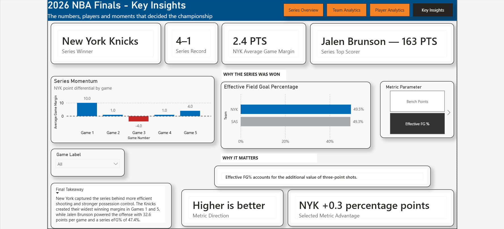
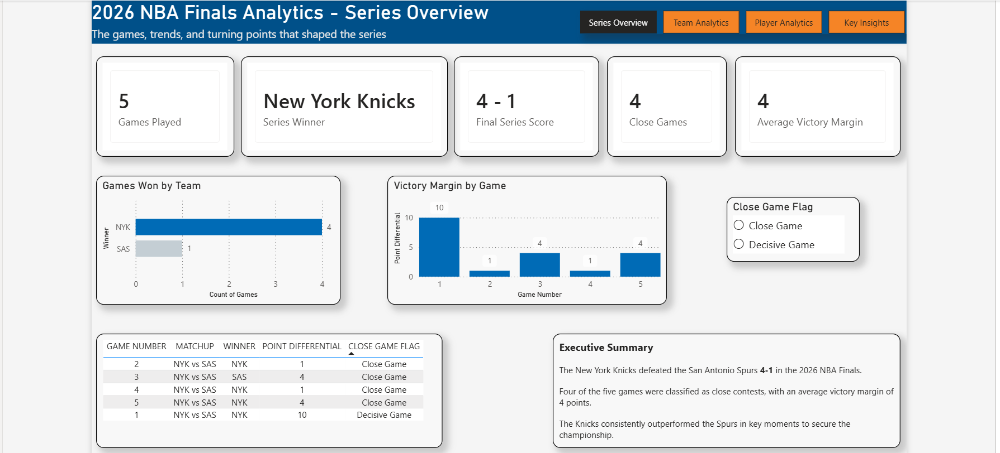
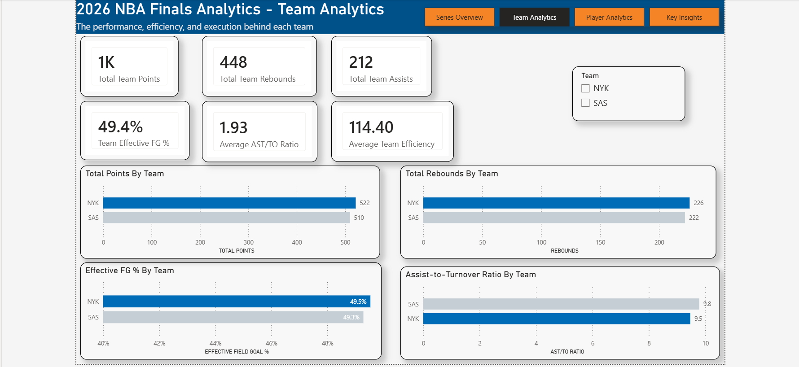
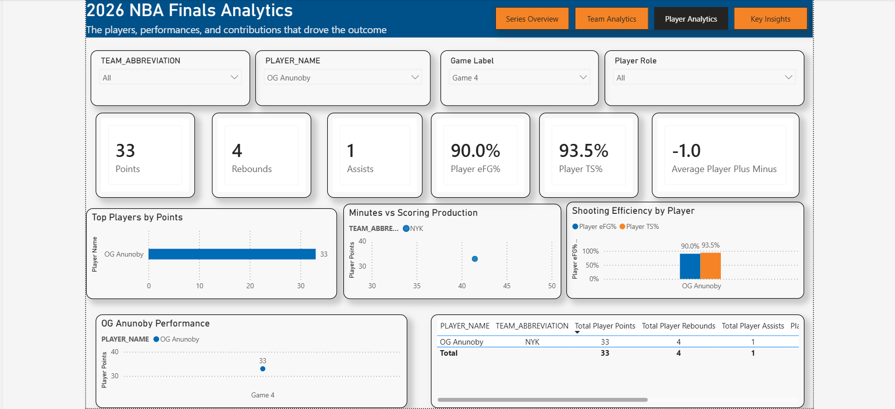

# 2026 NBA Finals Analytics

An end-to-end basketball analytics project analyzing the 2026 NBA Finals between the **New York Knicks and San Antonio Spurs** using **Python, Pandas, NBA API, Power BI, and DAX**.

The project covers the full analytics workflow, including data collection, cleaning, feature engineering, data modeling, dashboard development, and written analysis.

---

## Dashboard Preview



---

## Project Overview

The goal of this project was to analyze the 2026 NBA Finals from multiple perspectives rather than focusing only on final scores.

The analysis includes:

* Game-by-game series progression
* Team scoring and rebounding
* Shooting efficiency
* Assist-to-turnover ratio
* Player scoring and efficiency
* Game margins
* Player-level performance
* Series momentum
* Key factors behind the final result

The final Power BI report includes four interactive dashboard pages:

* **Series Overview**
* **Team Analytics**
* **Player Analytics**
* **Key Insights**

---

## Key Findings

* The **New York Knicks won the series 4–1**.
* New York created its largest winning margin in **Game 1 with a 10-point victory**.
* The Knicks also closed the series with a **4-point win in Game 5**.
* **Jalen Brunson led the series with 163 total points and averaged 32.6 points per game**.
* New York held a slight advantage in **Effective Field Goal Percentage**, finishing at **49.5% compared with San Antonio's 49.3%**.
* The Knicks' advantage came from a combination of shooting efficiency, possession control, individual scoring, and consistent execution throughout the series.

---

## Dashboard Pages

### Series Overview



Provides a high-level summary of the Finals, including the series winner, game results, victory margins, close-game classification, and series progression.

### Team Analytics



Compares New York and San Antonio across team-level metrics such as points, rebounds, assists, Effective Field Goal Percentage, team efficiency, and Assist-to-Turnover Ratio.

### Player Analytics



Allows users to explore individual performances using filters for team, player, game, and player role. The dashboard includes scoring, rebounding, assists, shooting efficiency, minutes played, and player efficiency.

### Key Insights


Brings together the most important findings from the project, including series momentum, scoring leaders, shooting efficiency, and the metrics that helped explain why New York won the championship.

---

## Data Pipeline

The project follows an end-to-end analytics workflow:

```text
NBA API
   ↓
Raw NBA Data
   ↓
Python + Pandas
   ↓
Data Cleaning
   ↓
Feature Engineering
   ↓
Player / Team / Game Analytics Tables
   ↓
Fact + Dimension Data Model
   ↓
Power BI + DAX
   ↓
Interactive Dashboard
   ↓
Final Analysis & Report
```

The raw dataset included **five Finals games and 150 player-game records**. Python and Pandas were used to clean the data, standardize identifiers, remove unnecessary fields, and create additional analytical variables.

---

## Feature Engineering

Several advanced basketball metrics were created during the analysis, including:

* Effective Field Goal Percentage
* True Shooting Percentage
* Assist-to-Turnover Ratio
* Three-Point Attempt Rate
* Free Throw Rate
* Points Per Minute
* Rebounds Per Minute
* Assists Per Minute
* Stocks
* Player Efficiency

These metrics helped expand the analysis beyond traditional box score totals and evaluate both production and efficiency.

---

## Data Model

The Power BI model uses a relational structure with dimension and fact tables.

### Dimension Tables

* `dim_player`
* `dim_team`
* `dim_game`

### Fact Table

* `fact_player_stats`

The fact table contains player performance records for each game and connects to the dimension tables using Player ID, Team ID, and Game ID.

---

## Tools & Technologies

**Python**
Used for data collection, cleaning, transformation, and feature engineering.

**Pandas**
Used for dataset manipulation, aggregation, and analytical table creation.

**NBA API**
Used to retrieve NBA game and player box score data.

**Power BI**
Used to build the interactive dashboards, visualizations, slicers, and analytical model.

**DAX**
Used to create dynamic calculations and measures within Power BI.

**GitHub**
Used to organize, document, and publish the complete analytics project.

---

## Repository Structure

```text
2026-nba-finals-analytics/
│
├── dashboards/
│   ├── 01_series_overview.png
│   ├── 02_team_analytics.png
│   ├── 03_player_analytics.png
│   └── 04_key_insights.png
│
├── data/
│   ├── raw/
│   └── processed/
│
├── docs/
│
├── images/
│
├── notebooks/
│
├── outputs/
│
├── powerbi/
│   └── 2026_NBA_Finals_Analytics_Final.pbix
│
├── reports/
│   └── 2026_NBA_Finals_Analytics_Report_Gideon_Amoah.pdf
│
├── src/
│
├── .gitignore
├── README.md
├── requirements.txt
└── run_pipeline.py
```

---

## Interactive Power BI Dashboard

**Interactive dashboard link:**
`Coming soon`

This link will be updated after the Power BI report is published online.

---

## Full Project Report

The full written analysis is available here:

[View the Full Analytics Report](reports/2026_NBA_Finals_Analytics_Report_Gideon_Amoah.pdf)

---

## Run the Project

Clone the repository:

```bash
git clone YOUR-GITHUB-REPO-URL
```

Move into the project directory:

```bash
cd 2026-nba-finals-analytics
```

Install dependencies:

```bash
pip install -r requirements.txt
```

Run the pipeline:

```bash
python run_pipeline.py
```

---

## Author

**Gideon Amoah**

Economics student with interests in data analytics, business analytics, sports analytics, and data-driven decision making.
